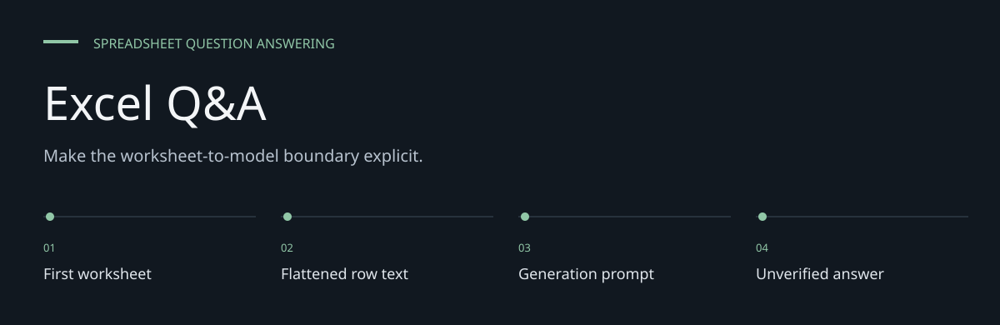
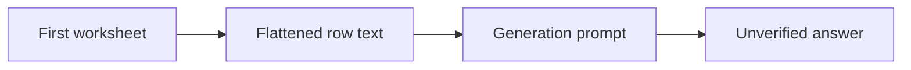

# Excel Q&A

**Make the worksheet-to-model boundary explicit.**

A Streamlit application that turns the first worksheet of an uploaded Excel file into text
and sends that text with a question to a Google Gemini generation model.


[Architecture](docs/ARCHITECTURE.md) · [Evaluation guide](docs/EVALUATION.md)

**Contents:** [The challenge](#the-challenge) · [Walkthrough](#walk-through-the-project) ·
[Implementation](#implementation-state) · [Design choices](#engineering-choices) ·
[Next evidence](#next-evidence-to-collect)

---

## The challenge

Natural-language questions can make spreadsheets approachable, but flattening a workbook changes
the information available to an answer model. This experiment exposes a simple first-sheet-to-text
path rather than a deterministic spreadsheet calculation engine.

## System at a glance



## Walk through the project

### 1. Upload an XLSX

Pandas reads the first worksheet by default. Other sheets are not automatically incorporated into
the question context.

### 2. Inspect the text conversion

Nonnull row values are joined into text. Headers, coordinates, types and formula semantics are not
preserved as a structured evidence model.

### 3. Submit the question

The flattened text and question enter one generation prompt sent to Google. A configured account
and compatible model/SDK are required.

### 4. Verify the result

Compare the answer with workbook cells manually. The app does not recompute numerical answers or
attach source-cell references.

## Data flow


The application uses a full-text prompt. It does not implement embeddings, vector retrieval,
spreadsheet formulas, deterministic numeric checks or source-cell citations.

## Local setup

```bash
git clone https://github.com/DanushArun/Excel_QnA-app.git
cd Excel_QnA-app
python3 -m venv .venv
source .venv/bin/activate
python -m pip install -r requirements.txt
streamlit run app.py
```

Set `GEMINI_API_KEY` in your local environment before launch. Supply your own account key;
do not reuse or publish credentials stored in a checkout.
The app names `gemini-1.5-flash` and pins `google-generativeai` 0.3.2. Current model access and
SDK compatibility were not verified with a live provider account in this update.

## What the UI does

1. Accept an `.xlsx` upload.
2. Read it through pandas and flatten nonempty row values into text.
3. Accept a question and submit a generation request.
4. Render the returned answer as Markdown.

Workbook content and the question leave the machine for the configured provider.
Use synthetic or authorized files when evaluating the app.

## Evidence and limits

Python syntax and README links were checked. No workbook-to-answer provider evaluation or
Cloud Run deployment check was performed. There is no automated test suite here.

Only the first worksheet is read by default. Flattening loses column names, data types and
cell coordinates. Large workbooks may exceed the model context limit. Answers, totals and
relevance refusals are not verified by the application; inspect the workbook before relying
on a generated result. A Dockerfile is included, but live deployment status is unverified.

## License

See [LICENSE](LICENSE).

## Engineering choices

**First-sheet scope.** The context boundary is narrower than an entire multi-sheet workbook.

**Generation is labeled.** A model answer is not a pandas-calculated aggregate.

**Credentials are local configuration.** Use your own authorized key rather than repository
artifacts.

## Implementation state

| State | Current evidence |
| --- | --- |
| Present | XLSX upload, parsing and question UI |
| Present | Full-text Gemini request source and Dockerfile |
| Not present | Cell citations, deterministic totals or vector retrieval |
| Not verified | Live model access, SDK compatibility and hosting |

The [architecture guide](docs/ARCHITECTURE.md) maps these statements to source entry points.
The [evaluation guide](docs/EVALUATION.md) separates inspection, executable checks and
domain validation, with the next evidence needed for each project.

## Next evidence to collect

- Verify provider/SDK compatibility without real workbook data.
- Evaluate multi-sheet and known-total synthetic workbooks.
- Add source-cell and deterministic calculation boundaries if extending the app.
