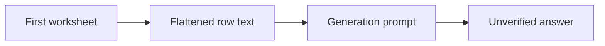

# Excel Q&A — Architecture and implementation

This guide follows the tracked implementation. Proposed work is identified separately.

## The problem and the system boundary

Natural-language questions can make spreadsheets approachable, but flattening a workbook changes
the information available to an answer model. This experiment exposes a simple first-sheet-to-text
path rather than a deterministic spreadsheet calculation engine.

## Processing path

## End-to-end behavior

### 1. Upload an XLSX

Pandas reads the first worksheet by default. Other sheets are not automatically incorporated into
the question context.

### 2. Inspect the text conversion

Nonnull row values are joined into text. Headers, coordinates, types and formula semantics are not
preserved as a structured evidence model.

### 3. Submit the question

The flattened text and question enter one generation prompt sent to Google. A configured account
and compatible model/SDK are required.

### 4. Verify the result

Compare the answer with workbook cells manually. The app does not recompute numerical answers or
attach source-cell references.

## Design choices and consequences

### First-sheet scope

The context boundary is narrower than an entire multi-sheet workbook.

### Generation is labeled

A model answer is not a pandas-calculated aggregate.

### Credentials are local configuration

Use your own authorized key rather than repository artifacts.

## Source entry points

### [app.py](../app.py)

- `extract_text_from_excel` — Extracts text data from the uploaded Excel file.
- `query_gemini_api` — Queries the Google Generative AI API with the provided text and question.
- `main` — Main function for the Streamlit app.

### [requirements.txt](../requirements.txt)

This file is part of the reviewed path described above. Follow its imports and calls
for the exact interface rather than inferring behavior from the filename.

### [Dockerfile](../Dockerfile)

This file is part of the reviewed path described above. Follow its imports and calls
for the exact interface rather than inferring behavior from the filename.

## Implementation state

| State | Evidence boundary |
| --- | --- |
| Present | XLSX upload, parsing and question UI |
| Present | Full-text Gemini request source and Dockerfile |
| Not present | Cell citations, deterministic totals or vector retrieval |
| Not verified | Live model access, SDK compatibility and hosting |

“Present” means tracked source or assets exist. It does not mean a production or domain
validation has passed. See [Evaluation](EVALUATION.md) for reproducible checks and limits.
